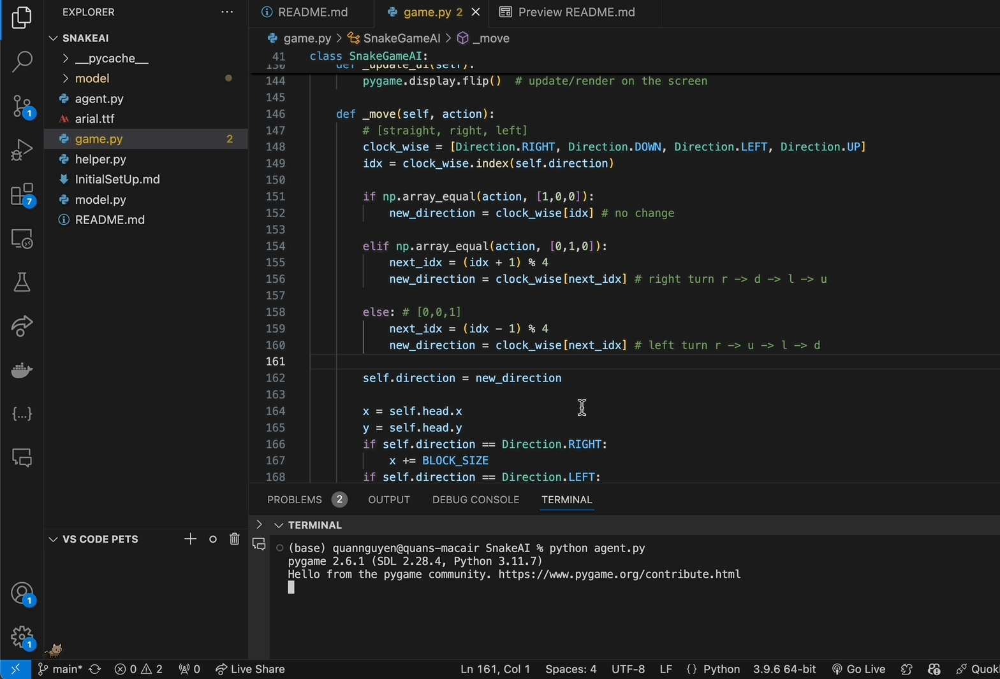

# Snake AI with Reinforcement Learning
Teaching myself how to train AI to play Snake Game

## How to Run
```
python agent.py
```

## Demo
<div align="center">
    <p>Running the app:</p>
    
</div>

## Tech Stacks
- Python/Pygame (Game)
- Agent (for ML training)
- Pytorch (Model)

## Lesson & Challenges
- Working with Pytorch and training a model is pretty challenging given my skillset (for now).
- Training can take super long (which is expected).
- Agent logic is fairly straight forward for a snake game so implementation was pretty easy.
- Learning Pytorch framework takes times and I love it.

